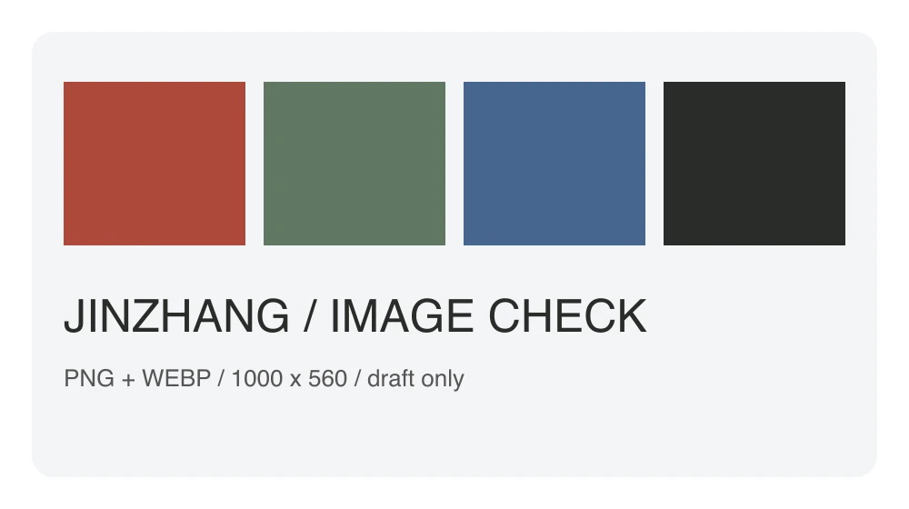

# 锦章网页版验收：把一篇 Markdown 认真排好

这是一篇专用于草稿验收的文章。它覆盖常见 Markdown 语法和图片输入，**不需要发布**。

## 一、段落与强调

普通段落可以包含 **加粗内容**、*斜体内容*、~~删除线内容~~，以及行内代码 `const answer = 42`。

第二个段落用于检查段间距。中文标点应与文字正常衔接：你好，世界！

这里是一行末尾带两个空格的软换行。  
这一句应换到下一行。

### 三级标题

#### 四级标题

##### 五级标题

###### 六级标题

深层标题在知乎允许降级为加粗段落，内容不能消失。

## 二、列表与引用

- 原文输入
- 排版预览
  - 核对结构
  - 核对图片
    - 观察嵌套层级

1. 选择主题
2. 复制正文
3. 粘贴并保存草稿

- [x] 已准备测试文章
- [ ] 保存后重开核对

> 好的内容，自有章法。
>
> 引用中的 **重点** 和 [项目链接](https://github.com/AFreeCoder/jinzhang-md-publisher) 应可辨认。

## 三、代码与表格

```typescript
function greet(name: string): string {
  const message = `你好，${name}`;
  return message;
}
console.log(greet("锦章"));
```

```json
{
  "platform": "wechat",
  "preserveImages": true,
  "count": 3
}
```

| 内容 | 公众号 | 知乎 |
| :--- | :---: | ---: |
| 标题与段落 | 样式预览 | 结构预览 |
| 代码与表格 | 保留正文 | 保留正文 |
| 图片 | 内嵌复制 | 上传后转存 |

---

## 四、链接与脚注

正文中的[内联链接](https://github.com/AFreeCoder/jinzhang-md-publisher)和[引用式链接][project]应可正常打开。网址自动识别：https://github.com/。

脚注用于补充说明[^note]。以下内容是原始 HTML 的安全子集：

<p><strong>原始 HTML 加粗文本</strong>与普通文字并列显示。</p>

## 五、图片与重复引用

第一张 PNG 用于核对清晰度与颜色：


同一张图再引用一次，用于核对重复图片：


WebP 输入应被转换为平台可使用的 JPEG 或 PNG：



原始 HTML 引用同一张图片：


## 六、验收结尾

请保存草稿后重新打开，确认标题层级、列表、代码换行、表格、链接与四处图片仍在。标题和封面需在平台单独设置。

[project]: https://github.com/AFreeCoder/jinzhang-md-publisher
[^note]: 这是脚注内容。若目标平台降级为文末参考说明，文字仍应保留。
